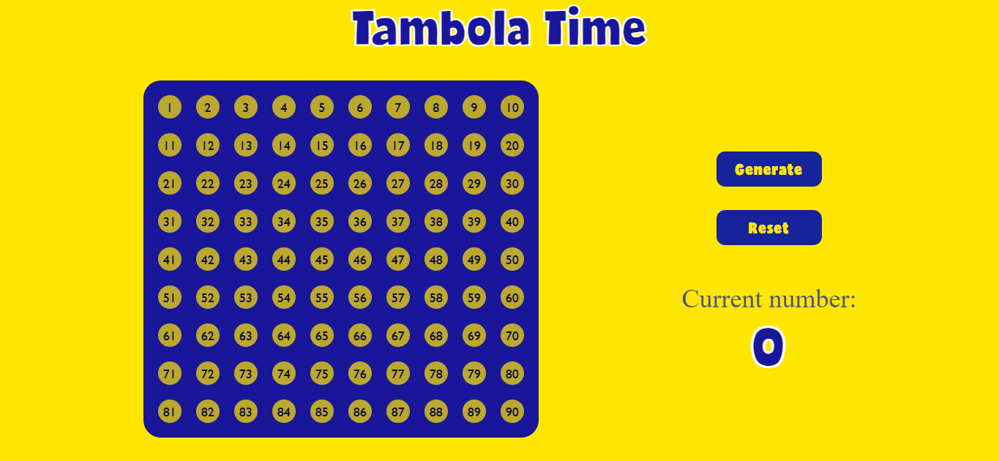
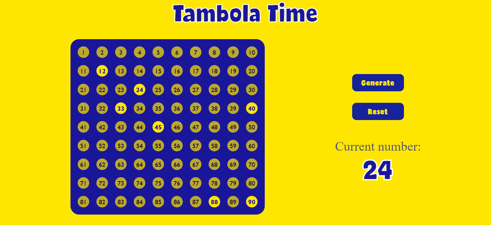

# tambola time
a random number generator for the classic number-drawing game Tambola (or Housie as you may call it)

home screen

after generating numbers

## features
- a generate button which when clicked displays a random number b/w 1 and 90
- reset button (for idk what)
- a table to show all the generated numbers

## credits
- thanks to [iFonts](ifonts.xyz) for the font
- this idea was stolen from my elder sis. she was thinking to make it but she moved on from web developement...